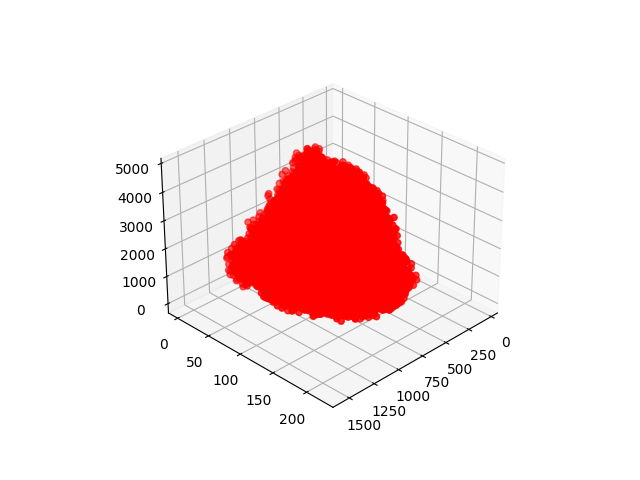

# eco_index-Revisited

## Introduction

In this project, we revisit the calculation method of the eco_index metric. This metric has been proposed to evaluate its absolute environmental performance from a given URL using a score out of 100 (higher is better). Our motivation comes from the fact that the calculation is based on both prior quantile calculations and weightings. We propose keeping only the weighting mechanism corresponding to documented and regularly available figures of the proportional breakdown of ICT's carbon footprint. 

This way, we will be able to follow, from year to year, the evolution of web requests from a carbon footprint point of view. For a URL, our new calculation method takes as parameters three weights and the three typical values of the eco_index (DOM size, number of HTTP/HTTPS requests, KB transferred) and returns an environmental performance score. 

We develop several ways to compute the score based on our new hypothesis, either using learning techniques (Locality Sensitive Hashing, K Nearest Neighbor) or matrix computation constitutes the project's first contribution. The second contribution corresponds to an experimental study that allows us to estimate the differences in results between the methods. The whole work allows us to observe the environmental performance of the WEB in a more generic way than with the initial method. 

Indeed, the initial process requires recalculating each quantile according to the value of the chosen weights. It is, therefore, necessary to launch a benchmark, the HTTP archive, for example, at each new weighting. Our approaches do not require a systematic switch to a benchmark; thus, it is more generic than the previously known one.

## Python codes and dataset explained

 - requirements.txt file serve as a list of items to be installed by pip, when using pip install. Files that use this format are often called “pip requirements.txt files”, since requirements.txt is usually what these files are named (although, that is not a requirement). So, to install the dependencies, run first `pip install -r requirements.txt`;

 - `config.ini` file serves as a configuration for the `verbose` parameter. Manually setting it to a value greater than 1 will result in a comprehensive debugging description being included in the output. However, if `verbose` is set to 1, only the expected output will be printed.

 - url_4ecoindex_dataset.csv is a dataset corresponding to more than 100k requests from the HTTParchive (a subset dated April 2022). This CSV file gives the URL, the DOM, request, and the size collected through the execution of test_eco_index.py on the URL. On the same line, you get the eco_index, then the water consumption and the gas emission values;
- test_eco_index.py implements the original eco_index; You get a CSV-like file with the URL, DOM, request, size, eco_index, water consumption, and gas emission;
```
$ python3 test_eco_index.py http://www.google.fr
http://www.google.fr ; 80 ; 12 ; 19160 ; 90.97 ; 1.18 ; 1.77
```
- random_projection.py implements a random projection method for the eco_index. The eco_index is given by the rank of the bin receiving the projection. The code generates random samples, and we compute the historical eco_index, the new eco_index, and then the difference between the two;
```
$ python3 random_projection.py
Plane-norms:  [[ 0.2251249   0.14437926  0.3455753 ]
 [-0.10159052  0.33428272  0.47959944]
 [ 0.10342357  0.01935221  0.11617527]
 [ 0.38999398  0.11141542 -0.2586675 ]
 [-0.38582652  0.26240475  0.35623112]
 [ 0.06537124 -0.49027634 -0.42345763]
 [-0.43143733  0.03655048  0.41205281]
 [ 0.33625441 -0.23131361  0.36325072]
 [-0.39474928  0.18521927 -0.36564689]
 [-0.01422019  0.19208727 -0.25837132]
 [ 0.41302447 -0.42083791 -0.39670167]
 [-0.40065976 -0.42283035  0.46042274]
 [-0.23034781 -0.11485182  0.12385592]
 [ 0.21681595  0.38261832  0.28784253]
 [-0.24997801  0.00581405 -0.13328182]
 [-0.07256512 -0.2118799   0.09576998]]
[   41    10 18482]  eco_index:  94.19653572440276  eco_index_Random_Projection:  91.8425268940261  Diff:  2.354008830376671
[   46    10 15112]  eco_index:  93.94971253435023  eco_index_Random_Projection:  91.8425268940261  Diff:  2.1071856403241327
[   24    28 14929]  eco_index:  92.25771647830204  eco_index_Random_Projection:  91.8425268940261  Diff:  0.4151895842759501
[   23    29 14974]  eco_index:  92.12546728053375  eco_index_Random_Projection:  91.8425268940261  Diff:  0.2829403865076614
[   44    24 12971]  eco_index:  91.92722608680008  eco_index_Random_Projection:  91.8425268940261  Diff:  0.08469919277398219
[   45    12 11180]  eco_index:  93.7688189594573  eco_index_Random_Projection:  91.8425268940261  Diff:  1.9262920654312126
[  49   23 3386]  eco_index:  91.8101687710553  eco_index_Random_Projection:  91.8425268940261  Diff:  -0.032358122970791214
[  32   15 3451]  eco_index:  94.11957681502088  eco_index_Random_Projection:  91.8425268940261  Diff:  2.2770499209947843
[   49    14 19967]  eco_index:  93.1775632826618  eco_index_Random_Projection:  91.8425268940261  Diff:  1.3350363886357002
[  47   18 6663]  eco_index:  92.80346731355671  eco_index_Random_Projection:  91.8425268940261  Diff:  0.9609404195306155
[  37   18 4369]  eco_index:  93.34840712853818  eco_index_Random_Projection:  91.8425268940261  Diff:  1.505880234512091
[  41   19 4908]  eco_index:  92.96591415890795  eco_index_Random_Projection:  91.8425268940261  Diff:  1.1233872648818561
[   20    21 16709]  eco_index:  93.68259813659849  eco_index_Random_Projection:  91.8425268940261  Diff:  1.8400712425723924
[  35   10 8773]  eco_index:  94.57081062462156  eco_index_Random_Projection:  91.8425268940261  Diff:  2.7282837305954644
[  31   25 7241]  eco_index:  92.48458269614169  eco_index_Random_Projection:  91.8425268940261  Diff:  0.6420558021155927
x=37.60 y=18.40 z=10874.33
```
- lsh.py implements a Locality Sensitive Hashing (LSH) method for the eco_index. We use the Falconn package and select two random queries taken from the input. We search for these two inputs and compute the eco_index according to the LSH method. We first go through the k=3 nearest neighbors, compute the barycenter, and then the eco_index; 
```
$ python3 lsh.py
Normalizing the dataset
Done
Generating queries
Queries:  [array([ 97.,  21., 172.], dtype=float32), array([122.,  59.,  25.], dtype=float32)]
Done
Solving queries using linear scan
Done
Linear scan time: 0.06975744999999733 per query
Constructing the LSH table
Done
Construction time: 16.425820600001316
Choosing number of probes
21 -> 1.0
Done
21 probes
found:  [0.48846823 0.10575085 0.86614984]  -->  [ 88.  19. 156.]
Centroid of the k nearest neighbors: [93.84, 20.31111111111111, 166.40444444444444]
eco_index: 58.44
found:  [0.885314   0.42814365 0.18141681]  -->  [122.  59.  25.]
Centroid of the k nearest neighbors: [168.88444444444445, 81.68444444444444, 34.60888888888889]
eco_index: 57.75
Query time: 2.9719452999997884
Precision: 1.0
We considered a space of 11390625 3d points
```
-  collinearity.py implements a method considering the most collinear vector points with the query for the eco_index metric. First, we isolate candidate points and compute the centroid of these points. The eco_index is calculated as a 'relative position' for the centroid in the considered virtual space. The following example shows the query with Dom=1<span>&#215;</span>9, request=1<span>&#215;</span>8, and size=1<span>&#215;</span>15. Parameter 8 corresponds to the virtual space size, i.e., 8<sup>3</sup>=512, meaning that we deal with 512 points conceptually.
```
$ python3 collinearity.py 1 1 1 9 5 15 8
Arguments count: 8
Argument      0: collinearity.py
Argument      1: 1
Argument      2: 1
Argument      3: 1
Argument      4: 9
Argument      5: 5
Argument      6: 15
Argument      7: 8
Query          : [9, 5, 15]
Normalizing the dataset of length: 512
Dataset normalized
Final centroid: [1.140625, 0.671875, 1.890625]
eco_index: 98.07
Query time: 0.01154590000078315
We used a 3-d virtual space of 512 random 3d points
```

- In the file `ComputeRMSE_euclidean_distance.py,` we compute an eco_index score based on the Euclidean distance from each (dom, request, size) point to the origin, namely (0, 0, 0). This is the most trivial definition we can put in place to bypass the quantiles and the weights. Our implementation considers that the point with the smallest distance to the origin has an eco_index score of 100, and the point with the greatest distance to the origin has an eco_index score of 100. Note that the input dataset does not contain the outliers we compute with the Scikit-learn iForest implementation. Indeed, we noticed, for instance, that the original dataset contains size components of high values. This fact induces that many eco_index scores are above 99.5 since the distance of all these corresponding points is low compared to the distance of a high value for the size component. Figure 1 presents an example of a dataset after eliminating the outliers.

<span style="display: flex; flex-direction: column;">
<figure>
 
 <br>
 <figcaption><b>&nbsp;&nbsp;&nbsp;&nbsp;&nbsp;&nbsp;&nbsp;&nbsp;Figure 1: </b> example of a dataset after canceling the outliers</figcaption>
 </figure>
<br>&nbsp;<br>
</span>


- In the file `ComputeRMSE.py,` we explore the `url_4ecoindex_dataset.csv` dataset, normalized with the weights (3, 2, 1) to align with the historical eco_index, and compute the RMSE (Root Mean Square Error) when considering the historical eco_index, and the one obtained through an LSH technique (Random projection method). For that purpose, we ported to Python 3  one existing LSH library and added some functionalities. See the comments in the source file. A sample of the result for the execution of this code is:
```
$ python ComputeRMSE.py
========= READING DATASET ================
========= END READING ================
Average Root Mean Square Error: 38.97772913572205
Min Root Mean Square Error: 22.115934637232897
Max Root Mean Square Error: 65.88938579204769
```

Anyway, please, read first the headers of Python programs for usage. You may also play with some internal variables. This is the case for the `ComputeRMSE*.py` files that compute the Root Mean Square Error (RMSE)  between the historical eco_index values and the other methods (also known as lsh-knn, random projection, and collinearity). File `ComputeRMSE_other.py` compute the RMSE for the new methods only. Here is an example of the execution of this program:

```
$ python ComputeRMSE_other.py
========= RANDOM PROJECTION VERSUS COLLINEARITY ============
Average Root Mean Square Error: 27.018904696132598
Min Root Mean Square Error: 0.00999999999999801
Max Root Mean Square Error: 79.45
========= RANDOM PROJECTION VERSUS LSH KNN ============
Average Root Mean Square Error: 27.043718769357834
Min Root Mean Square Error: 0.01999999999999602
Max Root Mean Square Error: 74.21
========= COLLINEARITY VERSUS LSH KNN ============
Average Root Mean Square Error: 3.910766054098699
Min Root Mean Square Error: 0.0
Max Root Mean Square Error: 21.130000000000003
========= DISTANCE VERSUS HISTORICAL ============
Average Root Mean Square Error: 27.564330966461355
Min Root Mean Square Error: 0.00999999999999801
Max Root Mean Square Error: 64.66
```

The `ComputeRMSE_other.py`code requires CSV files, namely `collinearity.csv, random_projection.csv`, `lsh_knn.csv`, and `euclidean_distance.csv`. Note that you can generate the CSV files through a command like:

```
$ python ComputeRMSE_lsh_knn.py  > lsh_knn.csv
```
Otherwise, you can use the provided ones. Check with the source code because this Python program may generate two output formats depending on an internal boolean value (myCSV).

## Analysis of the dataset

File `analysis_mj.ipynb` corresponds to a Jupyter notebook analyzing data over file `url_4ecoindex_dataset.csv`. It aims to check how different the new eco_index and the historical eco_index, faced quantiles updates. Visualization helps to quantify the differences throughout multiple techniques and metrics. File `analysis_mj.pdf` is the generated PDF file obtained after running the analysis.

## Self-Organizing Map (SOM)

File `som_test1.py` generates a PNG image corresponding to a self-organizing map. SOM is used in the exploration phase, and it clusters data. The dataset used in this example is `som_dataset.csv`, built from ARCEP (`2022_QoS_Metropole_data_habitations.csv`) and ENEDIS (`consommation-electrique-par-secteur-dactivite-commune.csv` ; `production-electrique-par-filiere-a-la-maille-commune.csv`) datasets. Some data from these datasets are combined with eco_index data (DOM, request, size...) for the URL. This example aims to demonstrate that we can deal with more than 10 energy-related attributes. Check with the header of `som_dataset.csv` to appreciate the metrics we deal with, and also with ARCEP and ENEDIS for their open data (`https://data.enedis.fr/explore/dataset/consommation-electrique-par-secteur-dactivite-commune/export/`; `https://data.enedis.fr/explore/dataset/production-electrique-par-filiere-a-la-maille-commune/export/?sort=annee` and `https://files.data.gouv.fr/arcep_donnees/mobile/mesures_qualite_arcep/2022/Metropole/`). In detail, the attributes are:
```
=== Reading ARCEP data from data/2022_QoS_Metropole_data_habitations.csv ===
Column names of ARCEP data:
<class 'pandas.core.frame.DataFrame'>
Int64Index: 5 entries, 0 to 4
Data columns (total 30 columns):
 #   Column                          Non-Null Count  Dtype
---  ------                          --------------  -----
 0   lieu                            5 non-null      object
 1   situation                       5 non-null      object
 2   date                            5 non-null      object
 3   heure                           5 non-null      object
 4   operateur                       5 non-null      object
 5   Profil                          5 non-null      object
 6   rsrp                            5 non-null      object
 7   latitude                        5 non-null      float64
 8   longitude                       5 non-null      float64
 9   protocole                       5 non-null      object
 10  url                             5 non-null      object
 11  file_name                       1 non-null      object
 12  file_type                       1 non-null      object
 13  terminal                        5 non-null      object
 14  adresse                         5 non-null      object
 15  strate                          5 non-null      object
 16  sous_strate                     4 non-null      object
 17  page_chargée_moins_5s           4 non-null      float64
 18  page_chargée_moins_10s          4 non-null      float64
 19  débit_en_Mbit/s                 0 non-null      float64
 20  video_en_qualité_parfaite       0 non-null      float64
 21  video_en_qualité_correcte       0 non-null      float64
 22  fichier_chargé_en_moins_de_30s  1 non-null      float64
 23  temps_en_secondes               5 non-null      object
 24  delai_lancement_stream_s        0 non-null      float64
 25  lag_stream_s                    0 non-null      float64
 26  accroche_5G                     5 non-null      int64
 27  INSEE_DEP                       0 non-null      float64
 28  INSEE_REG                       0 non-null      float64
 29  NOM_DEP                         0 non-null      float64
dtypes: float64(13), int64(1), object(16)
memory usage: 1.2+ KB
None
=== Reading year 2021 ENEDIS data from of data/consommation-electrique-par-secteur-dactivite-commune.csv ===
Column names of ENEDIS data (consomation):
<class 'pandas.core.frame.DataFrame'>
Int64Index: 32202 entries, 5 to 292431
Data columns (total 47 columns):
 #   Column                                                                     Non-Null Count  Dtype
---  ------                                                                     --------------  -----
 0   Année                                                                      32202 non-null  int64
 1   Code Commune                                                               32202 non-null  int64
 2   Nom Commune                                                                32202 non-null  object
 3   Code EPCI                                                                  32202 non-null  object
 4   Nom EPCI                                                                   32202 non-null  object
 5   Type EPCI                                                                  32202 non-null  object
 6   Code Département                                                           32202 non-null  int64
 7   Nom Département                                                            32202 non-null  object
 8   Code Région                                                                32202 non-null  int64
 9   Nom Région                                                                 32202 non-null  object
 10  CODE CATEGORIE CONSOMMATION                                                32202 non-null  object
 11  CODE GRAND SECTEUR                                                         32202 non-null  object
 12  CODE SECTEUR NAF2                                                          0 non-null      float64
 13  Nb sites                                                                   32156 non-null  float64
 14  Conso totale (MWh)                                                         32156 non-null  float64
 15  Conso moyenne (MWh)                                                        32156 non-null  float64
 16  Nombre de mailles secretisées                                              32202 non-null  float64
 17  Part thermosensible (%)                                                    9231 non-null   float64
 18  Conso totale  usages thermosensibles (MWh)                                 9231 non-null   float64
 19  Conso totale  usages non thermosensibles (MWh)                             9231 non-null   float64
 20  Thermosensibilité totale (kWh/DJU)                                         9231 non-null   float64
 21  Conso totale corrigée de l'aléa climatique  usages thermosensibles (MWh)   9231 non-null   float64
 22  Conso moyenne usages thermosensibles (MWh)                                 9231 non-null   float64
 23  Conso moyenne  usages non thermosensibles (MWh)                            9231 non-null   float64
 24  Thermosensibilité moyenne (kWh/DJU)                                        9231 non-null   float64
 25  Conso moyenne corrigée de l'aléa climatique  usages thermosensibles (MWh)  9231 non-null   float64
 26  DJU à TR                                                                   9231 non-null   float64
 27  DJU à TN                                                                   9231 non-null   float64
 28  Nombre d'habitants                                                         32202 non-null  float64
 29  Taux de logements collectifs                                               32202 non-null  float64
 30  Taux de résidences principales                                             32202 non-null  float64
 31  Superficie des logements < 30 m2                                           32202 non-null  float64
 32  Superficie des logements 30 à 40 m2                                        32202 non-null  float64
 33  Superficie des logements 40 à 60 m2                                        32202 non-null  float64
 34  Superficie des logements 60 à 80 m2                                        32202 non-null  float64
 35  Superficie des logements 80 à 100 m2                                       32202 non-null  float64
 36  Superficie des logements > 100 m2                                          32202 non-null  float64
 37  Résidences principales avant 1919                                          32202 non-null  float64
 38  Résidences principales de 1919 à 1945                                      32202 non-null  float64
 39  Résidences principales de 1946 à 1970                                      32202 non-null  float64
 40  Résidences principales de 1971 à 1990                                      32202 non-null  float64
 41  Résidences principales de 1991 à 2005                                      32202 non-null  float64
 42  Résidences principales de 2006 à 2015                                      32202 non-null  float64
 43  Résidences principales après 2016                                          32202 non-null  float64
 44  Taux de chauffage électrique                                               32202 non-null  float64
 45  geom                                                                       32202 non-null  object
 46  centroid                                                                   32202 non-null  object
dtypes: float64(33), int64(4), object(10)
memory usage: 11.8+ MB
None
=== Reading year 2021 ENEDIS data from of data/production-electrique-par-filiere-a-la-maille-commune.csv ===
Column names of ENEDIS data (production):
<class 'pandas.core.frame.DataFrame'>
Int64Index: 43474 entries, 379295 to 428763
Data columns (total 25 columns):
 #   Column                                                  Non-Null Count  Dtype
---  ------                                                  --------------  -----
 0   Année                                                   43474 non-null  int64
 1   Nom commune                                             43474 non-null  object
 2   Code commune                                            43474 non-null  int64
 3   Nom EPCI                                                43474 non-null  object
 4   Code EPCI                                               43474 non-null  object
 5   Type EPCI                                               43474 non-null  object
 6   Nom département                                         43474 non-null  object
 7   Code département                                        43474 non-null  int64
 8   Nom région                                              43474 non-null  object
 9   Code région                                             43474 non-null  int64
 10  Domaine de tension                                      43474 non-null  object
 11  Nb sites Photovoltaïque Enedis                          25674 non-null  float64
 12  Energie produite annuelle Photovoltaïque Enedis (MWh)   25674 non-null  float64
 13  Nb sites Eolien Enedis                                  43285 non-null  float64
 14  Energie produite annuelle Eolien Enedis (MWh)           43285 non-null  float64
 15  Nb sites Hydraulique Enedis                             43362 non-null  float64
 16  Energie produite annuelle Hydraulique Enedis (MWh)      43362 non-null  float64
 17  Nb sites Bio Energie Enedis                             43422 non-null  float64
 18  Energie produite annuelle Bio Energie Enedis (MWh)      43422 non-null  float64
 19  Nb sites Cogénération Enedis                            43453 non-null  float64
 20  Energie produite annuelle Cogénération Enedis (MWh)     43453 non-null  float64
 21  Nb sites Autres filières Enedis                         43092 non-null  float64
 22  Energie produite annuelle Autres filières Enedis (MWh)  43092 non-null  float64
 23  Geo Shape                                               43474 non-null  object
 24  centroid                                                43474 non-null  object
dtypes: float64(12), int64(4), object(9)
memory usage: 8.6+ MB
```

The following CSV files contain data issued from ARCEP, ENEDIS, and coming from the eco_index computation: `som_dataset.csv, som1.csv`. The exploitation of these two datasets is done with `som.py, som_test1.py`, respectively. Note that `som_test1.py` deals with categorial data (operator, city, and URL) and builds maps, i.e., a clustering and a U-matrix. Note also that the Python codes generate PNG images. All of these implementations come in the context of exploring datasets related to the environmental impact of HTTP requests.

## Computing the energy and emissions of the new methods

Files `codecarbon_*.py` compute the energy and emissions of our new methods over 100k URLs taken in the `url_4ecoindex_dataset.csv` dataset for the given (dom, req, size) attributes.

## Bibliography

```
@inproceedings{DBLP:conf/compsac/CerinTM23,
  author       = {Christophe C{\'{e}}rin and
                  Denis Trystram and
                  Tarek Menouer},
  editor       = {Hossain Shahriar and
                  Yuuichi Teranishi and
                  Alfredo Cuzzocrea and
                  Moushumi Sharmin and
                  Dave Towey and
                  A. K. M. Jahangir Alam Majumder and
                  Hiroki Kashiwazaki and
                  Ji{-}Jiang Yang and
                  Michiharu Takemoto and
                  Nazmus Sakib and
                  Ryohei Banno and
                  Sheikh Iqbal Ahamed},
  title        = {The eco_index metric, reviewed from the perspective of Data Science
                  techniques},
  booktitle    = {47th {IEEE} Annual Computers, Software, and Applications Conference,
                  {COMPSAC} 2023, Torino, Italy, June 26-30, 2023},
  pages        = {1141--1146},
  publisher    = {{IEEE}},
  year         = {2023},
  url          = {https://doi.org/10.1109/COMPSAC57700.2023.00172},
  doi          = {10.1109/COMPSAC57700.2023.00172},
  timestamp    = {Mon, 07 Aug 2023 15:56:21 +0200},
  biburl       = {https://dblp.org/rec/conf/compsac/CerinTM23.bib},
  bibsource    = {dblp computer science bibliography, https://dblp.org}
}
```


